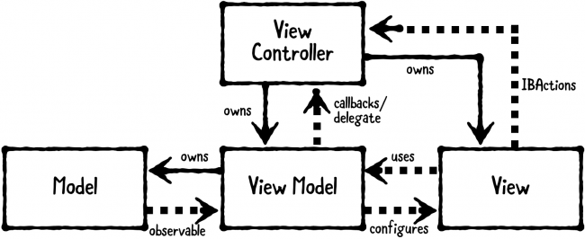
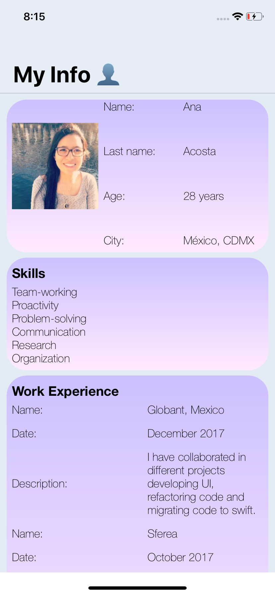
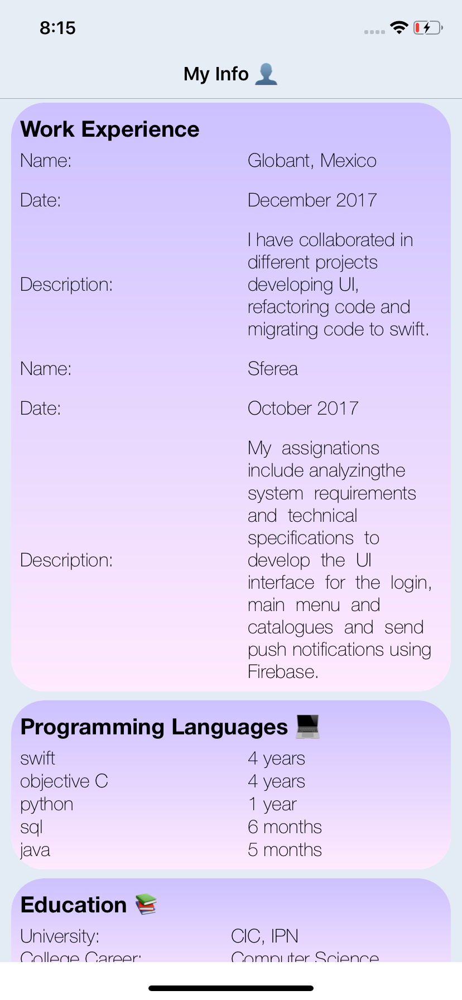
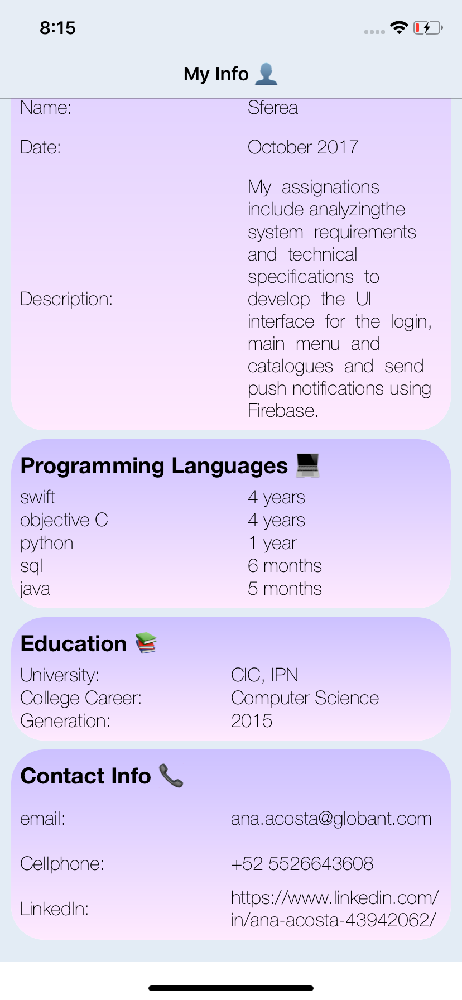
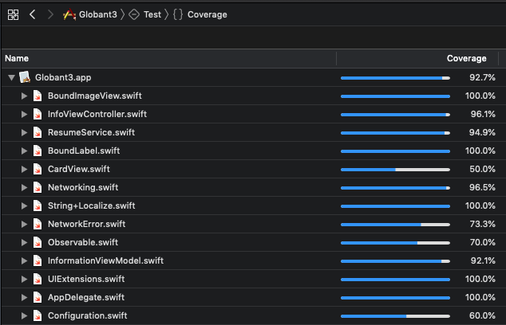

# Application for introduce someone in a new professional space.

## Instructions.

+ This app was made for iOS 12.1, to run you need Xcode 10.1.

+ The app runs on Portrait (no landscape).

+ Only iPhone.

## Architecture

### MVVM

Model-View-View-Model is a structural design pattern that separates objects into three distinct groups:

+ Models -> Hold application data.

+ Views -> Display visual elements and control interactions with the user.

+ View models -> Transform the model information into values that can be readed by the views for display.

	

---

## How the App looks like

Main screen:

| First Screen  | Second Screen | Third Screen |
| ------------- | ------------- | ------------- |
|  |  |  |

### Test Coverage

